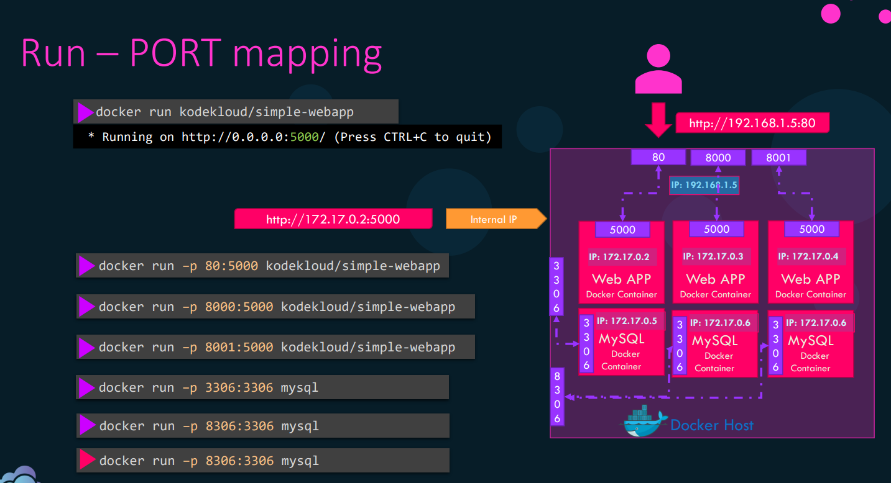

# Docker Engine

Docker Demon (Docker Server)<------>Rest API  <------>Docker cli

Docker Ports :&#x20;

```
2375 : Un-encrypted traffic
2376 : Encrypted    traffic
```

&#x20;OCI : open container initiative.&#x20;

We can run containers without installing Docker.

default data directory for Docker : /var/lib/docker/

## Docker objects :&#x20;

* **Docker Image** : A Docker image is a lightweight, read-only template that contains a base image of Os system or application like web server or db
* **Docker Container :** A Docker container is read-write template , runnable instance version created from a Docker image. It's an isolated and self-sufficient environment that contains the application and all its dependencies. Containers run on the host operating system but are isolated from each other and from the host system.&#x20;
* **Docker Networks:** Docker networks provide a way for containers to communicate with each other or with external networks while maintaining isolation.
* **Docker Volumes:** Docker volumes are mechanisms for persistently storing data generated by containers or for sharing data between containers and the host system. Containers are designed to be stateless and ephemeral, meaning that their data doesn't persist after they're stopped or destroyed. Volumes provide a way to overcome this limitation by allowing data to be stored externally from the container and shared between containers if necessary. Volumes are particularly useful for databases, file storage, or any scenario where data persistence is required.

## ------------------------------------------------------------------------------------------------------------------------------------

## &#x20;A Docker registry :&#x20;

&#x20;is a central repository that stores and manages Docker images. It's a service that allows you to upload, store, and share Docker images with others. Docker images can be quite large, especially when they contain all the dependencies and runtime environments required for an application.

A Docker registry :&#x20;

* public  (Docker Trusted Registry (DTR) and Docker hub)
* private&#x20;

## ------------------------------------------------------------------------------------------------------------------------------------

## Docker Engine Architecture

<figure><figcaption></figcaption></figure>

## ------------------------------------------------------------------------------------------------------------------------------------&#x20;

When you try to run ubuntu image, you can't why? Because docker is not designed for hosting an operating system&#x20;

but docker only meant to run specific task or process such : running instance of web server or data base or application server

The container only lives when the process inside it is alive when the process <mark style="color:purple;">crash</mark> or <mark style="color:yellow;">die</mark> or <mark style="color:green;">stopped</mark> the <mark style="color:red;">container will exits</mark>&#x20;

<pre><code>docker container run ubuntu
Unable to find image 'ubuntu:latest' locally
latest: Pulling from library/ubuntu
2746a4a261c9: Pull complete
4c1d20cdee96: Pull complete
0d3160e1d0de: Pull complete
c8e37668deea: Pull complete
Digest: sha256:250cc6f3f3ffc5cdaa9d8f4946ac79821aafb4d3afc93928f0de9336eba21aa4
Status: Downloaded newer image for ubuntu:latest
docker container ls -a
CONTAINER ID IMAGE COMMAND CREATED STATUS PORTS NAMES
d969ecdb44ea ubuntu "/bin/bash" 2 minutes ago <a data-footnote-ref href="#user-content-fn-1">Exited (0) 2 m</a>inutes ago intelligent_almeida
</code></pre>

instead of run ubuntu image we can run process inside ubuntu image using options&#x20;

now we will run shell inside ubuntu

\-t : terminal&#x20;

\-i : interactive&#x20;

```
docker container run -it ubuntu
root@6caba272c8f5:/#
root@6caba272c8f5:/# hostname
6caba272c8f5
root@6caba272c8f5:/#
```

note : options before container name passing to container&#x20;

options after container name passing to as container&#x20;

\---------------------------------------------------------------------

## &#x20; Restart Policies :&#x20;

why containers stops ?

1- after finish its work (exit code = 0)

```
docker container run ubuntu expr 3 + 5
docker container ls -l
ubuntu "expr 3 + 5" Exited (0) 11 seconds ago
```

2-A container may stop due to a failure like passing  incorrect type of parameter(exit code = 1)

```
docker container run ubuntu expr three + 5
docker container ls -l
ubuntu "expr three + 5" Exited (1) 2 seconds ago
```

3-A container can stopped manually by Docker stop command (SIGTERM signal followed by the SIGKILL signal) (exit code = 0)

```
docker container stop httpd
docker container ls -l
httpd "httpd-foreground" Exited (0) 4 days ago
```

you can configure the container to restart automatically after any of the above situation by the Restart Policies : &#x20;

<figure><figcaption></figcaption></figure>

```
docker container run --restart=no ubuntu # default
docker container run --restart=on-failure ubuntu
docker container run --restart=always ubuntu
docker container run --restart=unless-stopped ubuntu
```

note : on always option it does not immediately restart the container once it is manually stopped. It is restarted only when the Docker daemon restarts(like : systemctl restart docker ), so keep that in mind. Because if an admin ran the Docker container stop command he ran it because he need to stop it&#x20;

\--------------------------------------------------------------------------------

## Live Restore

it's a configuration that's make your containers don't stops and still running when your Docker Daemon stopped/Crash&#x20;

```
gedit/etc/docker/daemon.json
{
"debug": true,
"hosts": ["tcp://192.168.1.10:2376"],
"live-restore": true #add this to your file
}
systemctl reload docker
```

\----------------------------------------------------------------------------------------------------

## &#x20;Publishing Ports  :&#x20;

&#x20;when you start a container this container will have internal ip and port which will be reachable from inside the host and to access it from outside your host you have to do something called **port mapping** :&#x20;

Port mapping is rule to link internal ip and port to external ip and port in your host and its saves in the ip tabels and you can see your docker mapping ports rule here :&#x20;

```
iptables -t nat –S DOCKER
```

<figure><figcaption></figcaption></figure>

### &#x20;there is more complicated status when your host have more than one NIC in this case if you use -p this will open the same port in the all NIC

you can specify one network interface if you have multiple NIC by using it's IP:

```
docker run –p 192.168.1.5:8000:5000 kodekloud/simple-webapp
```

you can only specify the internal port and docker will chose random external port from /proc/sys/net/ipv4/ip\_local\_port\_range&#x20;

```
docker run –p 5000 kodekloud/simple-webapp
```

**importaaaant : if you have multiple internal port in your docker container and you want to maps it ALL using one command use -P option(-p : static port not change after restart -P: random dynamic port change after restart)**

```
docker run –P kodekloud/simple-webapp
```

and you can see all the container internal ports using "docker inspect \[container name]" in the expose field

```
docker run –P --expose=8080 kodekloud/simple-webapp
-P: This flag tells Docker to publish all exposed ports to random ports on the host. For example, if the container exposes port 8080, Docker will map it to a random port on the host.

--expose=8080: This flag specifies that the container will expose port 8080. This doesn't 
```

[^1]: 
