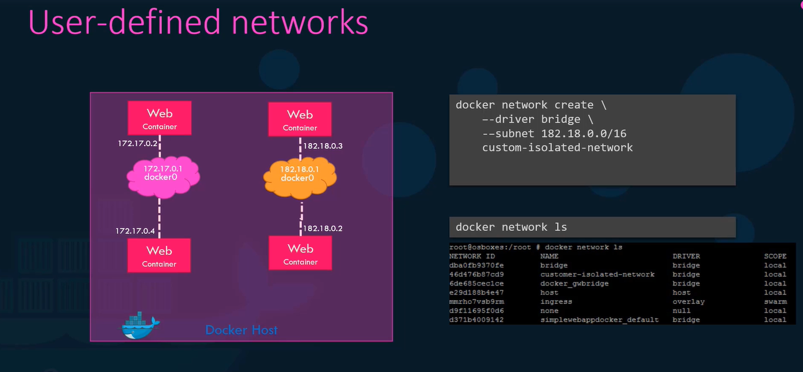
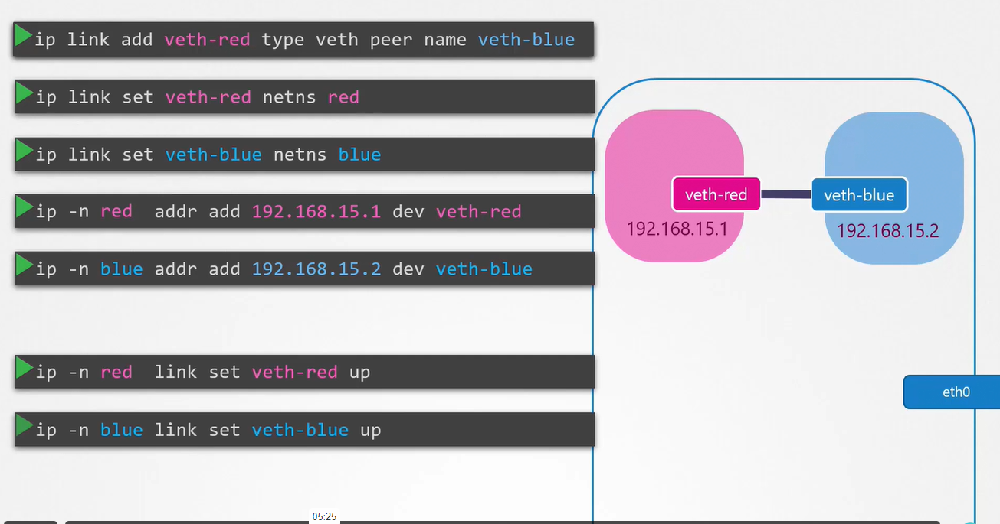

# Docker Network

Default networks type in Docker :&#x20;


<figure><figcaption></figcaption></figure>

Bridge : the default option all the containers in it will have internal ip and using it the containers will communicate with each other using with this internal ip (usually starts with 127.17.\*.\*)

The containers can access each other using this internal IP if required.

&#x20;<mark style="color:red;">To access any of these containers from the outside world, map the ports of these containers to ports on the Docker host as we have seen before.</mark>&#x20;

Another way to access the containers externally using the network type <mark style="color:red;">host</mark>&#x20;

### **Host** :&#x20;

when you use this option on the container directly will takes out any network isolation between the Docker host and the Docker container. Meaning, if you were to run a web server on port 5000 in a web app container, it is automatically accessible on the same port externally without requiring any port mapping as the web container uses the host's network. This would also mean that unlike before, you will now not be able to run multiple web containers on the same port (لانهم بشتركوا بنفس الاي بي واللي هو اي بي الهوست نفسه )

### none : the container is run on isolated network and dont have any access to the  external network or the other containers


\------------------------------------------------------------------------------

in the bridge you can make another small network (user-defined network) for containers from the other containers network : &#x20;

<figure><figcaption></figcaption></figure>

## Create a user-defined network and attach container to it&#x20;

```
escanor@escanor-virtual-machine:~/Desktop$ docker network create --driver=bridge --subnet=192.168.10.0/24 mohannadnetwork
6d24fe713173e1051463a6076d61272445b5349f287273aa899b780142c29874
escanor@escanor-virtual-machine:~/Desktop$ docker network ls
NETWORK ID     NAME              DRIVER    SCOPE
704d50c55507   bridge            bridge    local
bc0d2399c7fc   host              host      local
6d24fe713173   mohannadnetwork   bridge    local
de76fdb4bfd5   none              null      local
escanor@escanor-virtual-machine:~/Desktop$ docker run -itd --net=mohannadnetwork ubuntu
832ad6dd411470a61dd3d6be8cc0f43cc8976c4432b0e1ff38b07123bfd7ec16

```

### How to know the network information for a container&#x20;

```
docker inspect [container name]
then find the network part
```

###

<pre><code><strong>find all the networks in your docker : 
</strong><strong>docker network ls 
</strong>find information about specefic network : 
docker network inspect [network id]
add and remove container to custom network : 
<strong>docker network connect custem-network my-container
</strong><strong>docker network disconnect custem-network my-container
</strong><strong>remove network : 
</strong>docker network rm custem-network #you cannot do this if there is a container connected to it 
delete all unused networks : 
docker networl prune
</code></pre>

### how should the containers communicate ?&#x20;

docker have a built in dns server so the best way to communicate with each other is using it's name instead of the ip because the ip changes every reboot\
\---------------------------------------------------------------------------------------

## Network namespaces(implement a network isolation) (اضافة غرفة معزولة لشبكة جهازك المحلية) :&#x20;

When the container is created, we create a network namespace for it. That way, it has no visibility to any network-related information on the host. Within its namespace, the container can have its own virtual interfaces, routing, and ARP tables. The container has its own interface.


to create a new namespace in your linux machine&#x20;

```
ip netns add [name space name]
```

**Launch Containers in the Custom Namespace:**

```
docker run --network=container:mynamespace -it ubuntu
```

list network namespaces in your linux machine&#x20;

```
ip netns
```

list the interfaces in your linux machine&#x20;

```
ip link 
```

list the interfaces that visible for a namespace in your linux machine (it works only when run it inside the name space) <mark style="color:red;">(by default you should only see the loop back interface)</mark>

```
ip -n [namespace] link
```

see all the arp tables for your linux&#x20;

```
arp
```

see arp table for a namespace

```
ip netns exec [namespace] arp
```

see all the route tables for your linux&#x20;

```
route
```

see route table for a namespace

<pre><code><strong>ip netns exec [namespace] route 
</strong></code></pre>

to execute commands from inside namespace :&#x20;

```
ip netns exec [namespace] [command]
```

## &#x20;add connection to namespace after create it :&#x20;

### add connection between two name spaces (using virtual Ethernet Cable )  :&#x20;

the ips bellow is random&#x20;


<figure><figcaption></figcaption></figure>

to delete the above cable :&#x20;

```
ip -n red link del veth-red # the other side of the cable will deleted automaticly
```

add more than two namespaces to communicate with each other over a switch :&#x20;

1 - create a switch (it's only a interface :smile:)

```
ip link add v-net-0 type bridge
```

2 - turn on the switch :&#x20;

```
ip link set dev v-net-0 up
```

3-connect the namespaces to the virtual switch :&#x20;

a-create new Cable :&#x20;

```
ip link add veth-red type veth peer name veth-red-br
```

b- connect the cable between the namespace and the switch &#x20;

```
ip link set veth-red netns red
ip link set veth-red-br master v-net-0
```

c- add ip address to namespace interface (we will not add ip address to the switch because he have one )&#x20;

```
ip -n red addr 192.168.15.1 dev veth-red
```

```
192.168.15.1 192.168.15.2 192.168.15.3 192.168.15.4 192.168.15.5 192.168.15.6 etc..
```

d- turn on the cable interface&#x20;

```
ip -n red link set veth-red up
```

then repeat all the above for every namespace you want to add it to this network&#x20;

<mark style="color:blue;">if I try to ping one of the above name spaces from my host it will not works because the host and the namespace is in different network</mark>&#x20;

<mark style="color:blue;">to make that work we have to utilize the switch because it considered as a interface for the host</mark>

```
ip addr add 192.168.15.5/24 dev v-net-0
```

